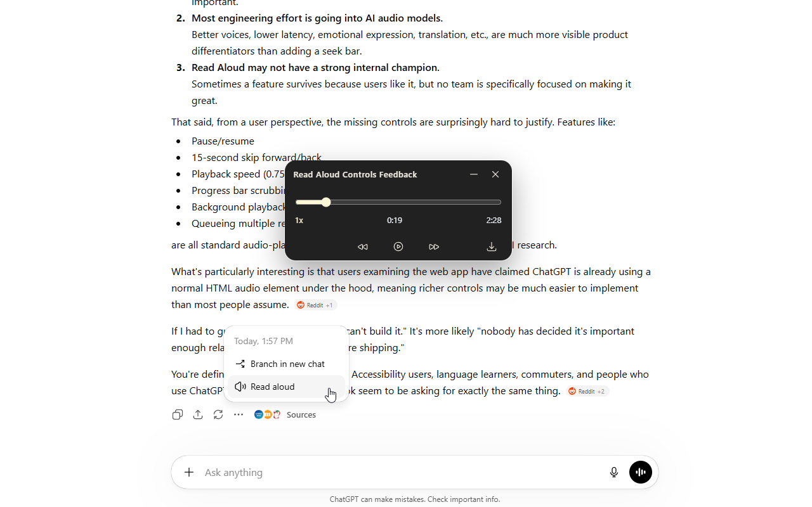

# chatgpt-audio-player

Audio player for the 'Read Aloud' feature

# DESCRIPTION:

This extension adds audio player controls when an Audio element is being played with the 'Read Aloud' feature of ChatGPT.

# RUNTIMES:

1. This player can be installed as a [Chrome extension](https://chromewebstore.google.com/detail/audio-player-for-chatgpt/pgogbhnjghehkajgclkpgplflfnjcgpm)

2. It can also be added as a script for violentmonkey/tampermonkey.  
   For that, just copy/paste the code in src/js/content-script.js.  
   It's ready to go.

# HOW IT WORKS:

-It checks if the tab is active.  
-If so, it checks if there's an audio element being played.  
-If so, it enables its native audio controls (audio.controls = true).  
-It positions the player next to the Share button.  
-It injects a playback speed button next to the player.

# PLAYBACK SPEED SELECTOR:

-A speed icon button is injected beside the player controls.
-Clicking the speed button opens a white popup panel directly below it.
-The popup includes fixed options: `0.75x`, `1x`, `1.25x`, `1.5x`, `1.75x`, `2x`.
-Selecting a speed applies immediately through `audio.playbackRate`.
-The selected speed is saved in `localStorage` using key `chatgptAudioPlayer.playbackRate`.
-When the player is shown, the saved speed is restored automatically.
-If the stored value is missing/invalid, playback falls back to `1x`.
-The speed button/popup visibility follows the player show/hide behavior.
-The selector uses a white background with dark text/icons to blend with ChatGPT UI.

# KNOWN ISSUES:

1. In Edge (Chromium), the first time an audio is played, the player may not show its duration for the first 3 to 7 seconds.  
   That's because the audio element generated by ChatGPT may have a 'duration' property of value 'Infinity', initially.  
   It may be caused by the audio being streamed, and it shows the duration once it's finished downloading.
2. In Firefox, the audio always has around 12 seconds of extra duration (not silence, just skips 12 seconds at the end).
   So it's not worth publishing the extension for FF just yet.

These issues could be probably fixed by intercepting the audio element returned by ChatGPT's call to the synthesizer.  
That approach is used in this repo: https://github.com/drengskapur/chatgpt-audio-enhancer  
I'm not using that approach to keep the code minimal, as users will likely copy the code to violentmonkey, and it works perfectly in Chrome.
