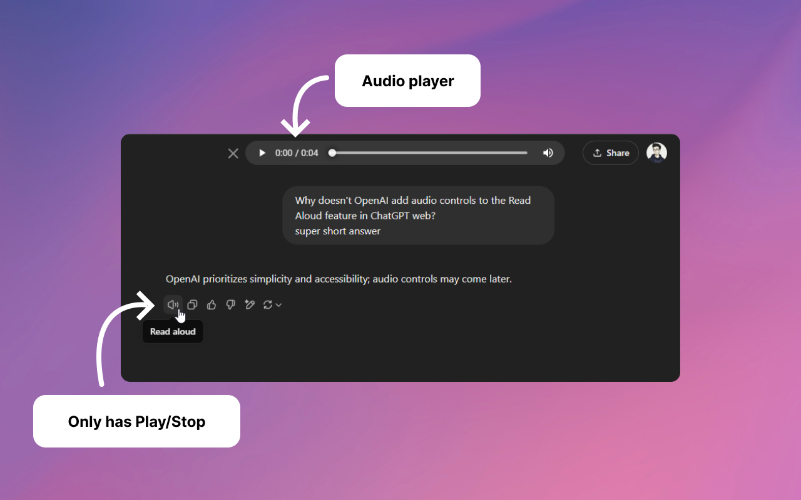

# chatgpt-audio-player

Audio player for the Read Aloud feature

# DESCRIPTION:

This file adds audio player controls when an audio element is being played with the 'Read Aloud' feature of ChatGPT.

# RUNTIMES:

1. This player can be installed as a Chrome extension.  
   Link here: {todo: add link when extension is published}

2. It can also be added as a script for violentmonkey/tampermonkey.  
   For that, just copy/paste the code in js/content-script.js.  
   It's ready to go 🚀

# HOW IT WORKS:

-It checks if the tab is active.  
-If so, it checks if there's an audio element being played.  
-If so, it enables its native audio controls (audio.controls = true).  
-It positions the player next to the Share button.

# KNOWN ISSUES:

1. In Chrome, the first time an audio is played, the player may not show its duration for the first 3 to 7 seconds.  
   That's because the audio element generated by ChatGPT may have a 'duration' property of value 'Infinity', initially.  
   It may be caused by the audio being streamed, and it shows the duration once it's finished downloading.
2. In Firefox, the audio always has around 12 seconds of extra duration. The seek bar reaches time - 12s and then jumps to the end.  
   So it's not worth publishing the extension for FF just yet.

These issues could be probably fixed by intercepting the audio element returned by ChatGPT's call to the synthesizer.  
That approach is used in this repo: https://github.com/drengskapur/chatgpt-audio-enhancer  
I'm not using that approach to keep the code minimal, as users will likely copy the code to violentmonkey.
